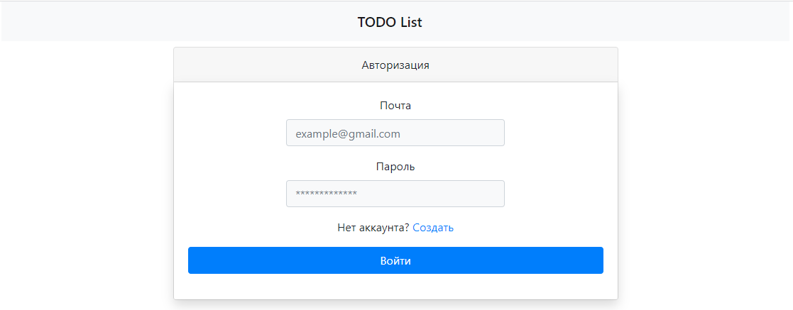
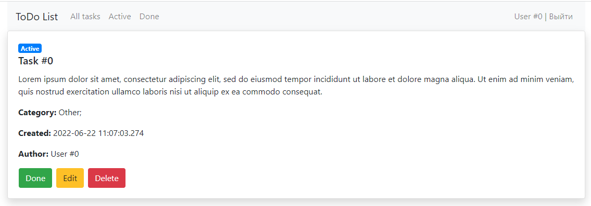
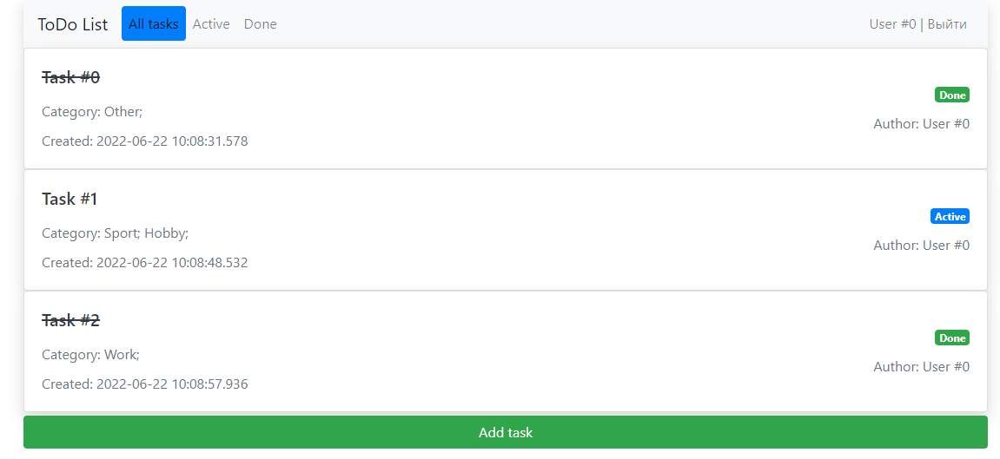
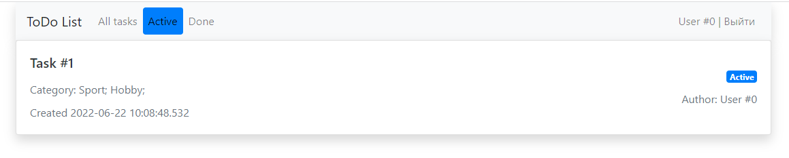

# TODO List

## О проекте.

#### Описание
Web-приложения для постановки и отслеживания задач.
Позволяет составлять списки дел и закрывать их по мере выполнения.

#### Технологии
> JDK11, Maven, Spring boot, Thymeleaf, Bootstrap, HTML, PostgreSQL, Hibernate, HQL

## Использование
Для начала работы в приложении необходимо ввести свои логин и пароль или зарегистрироваться. 

Главное окно приложения состоит из списка задач, каждая задача помечена меткой("Active" или "Done"). 

Для добавления задачи кликаем на кнопку "Add task".

Кликнув по названию можно перейти в карточку задачи, где указано описание.

Есть возможность редактировать задачу, отметить как "Выполнено", а также удалить задачу.

Так же можно перейти на страницу отображения только выполненных или только активных задач.

### Контакты
[][telegram]
[][gmail]
[][linkedin]

[telegram]: https://t.me/GrokDen
[gmail]: mailto:den.voiten@gmail.com
[linkedin]: https://www.linkedin.com/in/denis-voytenko-585488117/
